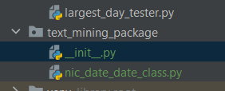

# Text Mining Programming Showcase

## Introduction

This project started out as the solution to a homework in
the [Coursera - University of Michigan](https://www.coursera.org/learn/python-text-mining)
text mining class. I found myself using many techniques that I have learned over the last 18 months on my current
project to solve the homework. Also, rather than build the solution in a jupyter notebook, I prefer to create
straight python in my favorite IDE **PyCHARM**. This allows me to leverage Object-Oriented solutions

Most of the work I've done for two years has been proprietary for the US Patent and Trademark Office.
Therefore, I wanted to create a project that has shown my Python skills. With solution of this homework, I saw the
opportunity
to get a two-for-one with this propert.

## The Assignment

> The following is taken from the Coursera Website.
>
> In this assignment, you'll be working with messy medical data and using regex to extract relevant infromation from the
> data.
>
> Each line of the `dates.txt` file corresponds to a medical note. Each note has a date that needs to be extracted, but
> each date is encoded in one of many formats.
>
> The goal of this assignment is to correctly identify all the different date variants encoded in this dataset and to
> properly normalize and sort the dates.
>
> Here is a list of some variants you might encounter in this dataset:
> * 04/20/2009; 04/20/09; 4/20/09; 4/3/09
> * Mar-20-2009; Mar 20, 2009; March 20, 2009; Mar. 20, 2009; Mar 20 2009;
> * 20 Mar 2009; 20 March 2009; 20 Mar. 2009; 20 March, 2009
> * Mar 20th, 2009; Mar 21st, 2009; Mar 22nd, 2009
> * Feb 2009; Sep 2009; Oct 2010
> * 6/2008; 12/2009
> * 2009; 2010

> Once you have extracted these date patterns from the text, the next step is to sort them in ascending chronological
> order accoring to the following rules:
> * Assume all dates in xx/xx/xx format are mm/dd/yy
> * Assume all dates where year is encoded in only two digits are years from the 1900's (e.g. 1/5/89 is January 5th,
    1989)
> * If the day is missing (e.g. 9/2009), assume it is the first day of the month (e.g. September 1, 2009).
> * If the month is missing (e.g. 2010), assume it is the first of January of that year (e.g. January 1, 2010).
> * Watch out for potential typos as this is a raw, real-life derived dataset.
    > With these rules in mind, find the correct date in each note and return a pandas Series in chronological order of
    the original Series' indices.

## Problem Solution Strategy

### REGEX = Success

At the core of my solution is using regex patterns to search for different date combinations.
I used Named Groups in order to make downstream processing easier, because .groupdict() in python will return the
matches as a dictionary. This solves the problem of how to deal with the fact that months and dates are in different
positions in the text. I created a single regex search pattern by concatenating strings and then compiling.
Since creating regex can be computationally expensive, I create the regex in a separate function and wrapped it in
@lru_cache
so that once the regex is created, it is accessed through the cache instead of being re-created.

---

    @lru_cache(maxsize=2)
    def create_date_regex() -> tuple[Pattern[str], ...]:
        """
        This function creates a complex regex pattern by concatenating strings and then compiling.
        It is wrapped in a @lru_cache so the code only has to be run once per instance.
        Named groups are used to set up dictionaries in groupdict() so results can be addressed by a common structure.
    
        :return: re.Pattern - regex pattern to find dates.
        """
        # Keeping the compilation in a separate function helps keep code clean and readable
        # In order to use repeated names we have to compile each separately.
        regex_string_tuples = (r'(?P<mmddyyyy>(?P<month>\d{1,2})[\-/](?P<day>\d{1,2})[\-/](?P<year>\d{1,4}))',
                               r'(?P<ddmmmyyyy>(?P<day>\d{1,2})\s+(?P<month>\w{3,})\s+(?P<year>[\d{2}|\d{4}]\s))',
                               r'(?P<ddmmmyy>(?P<month>\w{3,})\s+(?P<day>\d{1,2})[,\s]+(?P<year>\d{2}\s))',
                               r'(?P<ddmmmyyyy>(?P<month>\w{3,})\s+(?P<day>\d{1,2})[,\s]+(?P<year>\d{4}))',
                               r'(?P<month>\w{3,})[,\s]+(?P<year>\d{4})')
    
        # Note -Tuples use less memory. If mutation is not needed, tuples are used herein
        compiled_regex_tuple = tuple(
            [re.compile(pattern=regex_string_tuple, flags=re.IGNORECASE) for regex_string_tuple in regex_string_tuples])
        return compiled_regex_tuple,

---

## Object-Oriented Structure

### Package

Even for small projects, an OO structure can give many advantages over solving a problem in a Jupyter Notebook.
A Jupyter notebook does not enforce order of code, and does not scale well. Itt may be overkill for a small package such
as this, I created an internal package called `text_mining_package`
with an init.py file so desired classes can be imported regardless of the underlying file name.

### Dataclass

It might be tempting to either store the date information found from regex searches 